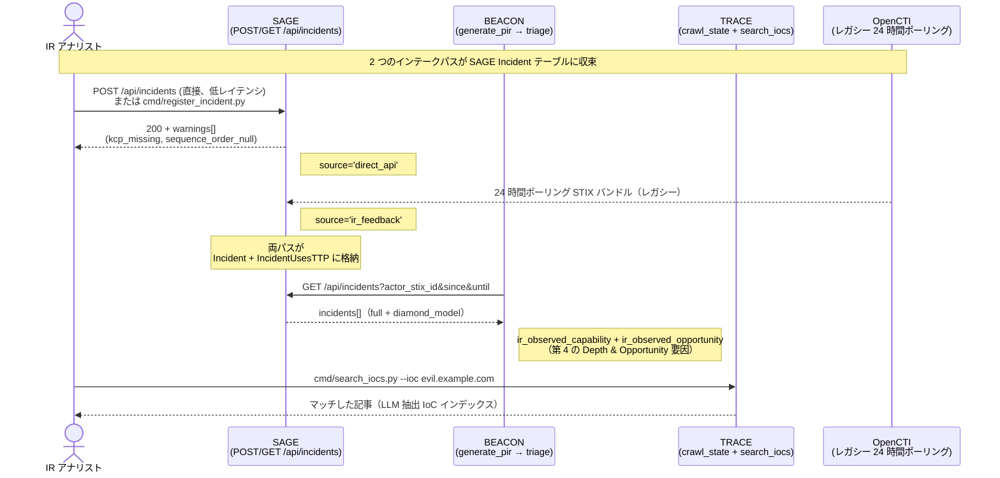

# IR フィードバックフロー — CTI ループを閉じる

**正本**: `sage/docs/ir-feedback-flow.md`。BEACON および TRACE のコピーは
`beacon/docs/ir-feedback-flow.md` と `trace/docs/ir-feedback-flow.md` として
本ファイルへの相対シンボリックリンクで管理されている。
ここで一度更新すれば、両コンシューマーに変更が反映される。

本ドキュメントは Initiative G（BEACON 0.18.0 + TRACE 1.11.0 + SAGE 0.13.0）で
導入された、エンドツーエンドの「IR 観測 → SAGE 登録 → BEACON 再スコアリング →
TRACE 検索」ループを説明する。既存の OpenCTI リレー経由のインシデント取り込みパスを
補完するものであり、置き換えるものではない。

---

## 1. ループ図



---

## 2. 直接 API パスを設けた理由

OpenCTI リレー（1 日 1 回のポーリング）には最悪 24 時間のレイテンシがある:
本日観測されたインシデントは、最短でも翌日以降にならないと BEACON の
Likelihood スコアリングに影響しない。OpenCTI を持たないオペレーターにとっては
そもそもパスが存在しない。

NIST SP 800-61r3（2025 年 4 月）§2.1 は、直接 API 追加の背景にあるポリシー上の
動機を述べている（原文 — NIST 出版物、17 USC §105 により米国政府著作物としてパブリックドメイン）:

> The lessons learned during incident response should often be shared
> **as soon as they are identified**, not delayed until after
> recovery concludes. Continuous improvement is increasingly
> necessary for all facets of cybersecurity risk management in order
> to keep up with modern threats.

直接 API は「識別されたらすぐに（as soon as they are identified）」という
特性を満たす。OpenCTI パスは引き続き有効であり、両者は `Incident` テーブルで
収束し、`Incident.source`（`direct_api` vs `ir_feedback`）で識別される。

---

## 3. 2 つのインテークパス

### 3.1 OpenCTI リレー（レガシー、保持）

| プロパティ | 値 |
|---|---|
| コンポーネント | OpenCTI Web UI + 夜間ポーラー |
| レイテンシ | 最大 24 時間 |
| `Incident.source` | `ir_feedback` |
| 前提条件 | OpenCTI のデプロイ |
| 最適用途 | すでに OpenCTI を運用している組織 |

### 3.2 直接 API（新規 — Initiative G）

| プロパティ | 値 |
|---|---|
| コンポーネント | `POST /api/incidents`（SAGE フェーズ 1）|
| レイテンシ | 秒単位 |
| `Incident.source` | `direct_api` |
| 前提条件 | `SAGE_API_AUTH_TOKEN` 環境変数（書き込み API ゲート）|
| 最適用途 | OpenCTI を持たない SMB 組織; ライブインシデント対応 |

両パスとも同一スキーマで `Incident` + `IncidentUsesTTP` 行を生成する。
下流クエリ（`/actor-ttps`、`/asset-exposure`、`/threat-summary`、`GET /api/incidents`）は
両方を透過的に読み取る。

---

## 4. 直接 API 書き込みサーフェス（SAGE）

### POST /api/incidents

PUT 的な完全置換 upsert（`incident_stix_id` が PK; 再 POST で以前のレコード全体を置換）。
必須フィールド: `incident_stix_id`（STIX 2.1 インシデントパターン）、`name`、`occurred_at`、`severity`。
任意: `kill_chain_phases[]`、`ttps[]`（`sequence_order` 付き）、`diamond_model`（Caltagirone ら による 4 キー dict）、`iocs[]`、`description`。

任意フィールドが欠落している場合、レスポンスの `warnings[]` に表示される:

| コード | 意味 |
|---|---|
| `kcp_missing` | `kill_chain_phases` なし — `IncidentUsesTTP` 行が導出されない |
| `sequence_order_null` | `ttps[].sequence_order` が NULL のエントリが 1 つ以上存在 — HLD §5.2 に従い `FollowedBy(ir_feedback)` の導出をスキップ |

警告は `sage_incident_warnings_total{code}` カウンターもインクリメントする
（Prometheus エンドポイントがない場合は structlog ログにフォールバック）。

### GET /api/incidents

BEACON の IR ブースト（以下 §5 参照）とオペレーター CLI ツールが消費する
読み取りエンドポイント。フィルタ: `since` / `until`（occurred_at の範囲）/
`actor_stix_id`。ページネーションは limit のみ（デフォルト 50、範囲 1-100）。
レスポンスには `incidents[].ttps[]` + `diamond_model` がインラインで含まれる。

GET ルートは `SAGE_API_AUTH_TOKEN` が未設定の場合も許可（現行デプロイメントとの後方互換）;
設定済みの場合は通常の Bearer 認証が適用される。POST ルートは設定時に必須であり、
**トークン未設定時には 503 を返す**（書き込み API フットガンゲート — §7 参照）。

### cmd/register_incident.py（CLI ヘルパー）

IR アナリスト向けの Click ベース CLI。4 つのモード:

| モード | フラグ | ユースケース |
|---|---|---|
| インタラクティブ | （フラグなし）| ヒント付きで 4 つの Diamond Model 象限を対話的に入力 |
| ファイル | `--from-file payload.json` | 非インタラクティブスクリプト |
| Navigator | `--navigator-layer layer.json` | MITRE Navigator の TTP シーケンスをインポート |
| 直接 | `--no-api` | エアギャップ環境 — HTTP をバイパスして Spanner に直接書き込む |

`--id incident--<uuid>` は自動生成される `incident--<uuid4>` を上書きする。
`--token` はデフォルトで `$SAGE_API_AUTH_TOKEN` を使用する。

---

## 5. BEACON IR ブースト（フェーズ 6）

BEACON の `generate_pir` パイプラインはアクタートリアージ中に
SAGE `GET /api/incidents` を呼び出す。`Likelihood = Intent × Capability × Opportunity`
の計算式に 2 つの新しい要因が加わる:

| 要因 | 位置 | 計算式 |
|---|---|---|
| `ir_observed_capability` | Capability の第 4 Depth 要因 | ルックバック期間内に自組織のインシデントがこのアクターの既知 TTP を 1 件以上使用している場合は 1.0; それ以外は 0.5（中立、0 ではない）|
| `ir_observed_opportunity` | Opportunity の第 4 要因 | ルックバック期間内にアクターが自組織を攻撃したことがある場合は 1.0; それ以外は 0.7（残余中立）|

集約は Initiative E で確立された [0, 1] 幾何平均スケールを維持する:

```
Depth       = (sophistication × tool_sophistication × evasion_capability × ir_observed_capability) ^ (1/4)
Opportunity = (victimology_match × geographic_match × surface_ttp_coverage × ir_observed_opportunity) ^ (1/4)
```

方法論の引用（MITRE Cyber Prep、フェアユース学術引用、© MITRE Corporation）:
Cyber Prep は Capability を「resources, skill or expertise, **knowledge**,
and opportunity」と定義している — 過去の攻撃の IR 観測は *knowledge* シグナルを
直接提供する。Cyber Prep の Targeting（「いかに広く・狭く・執拗に
アドバーサリーが特定の組織を標的にするか」）は BEACON の `ir_observed_opportunity`
にマッピングされる。

### ルックバックウィンドウ

`BEACON_IR_LOOKBACK_DAYS` 環境変数（デフォルト 365）。本 Initiative では
アクターごとの設定はなく、グローバルな単一設定。

### フェイルソフト

SAGE に到達できない場合、両要因はデフォルトで中立の 1.0（幾何平均の単位元）となり、
`data_quality.degraded=True` が優先度付きアクターエントリに設定され、
失敗理由が構造化ログとして出力される。オペレーターは BEACON の `--no-sage` フラグで
この呼び出しを明示的にスキップすることもできる（呼び出し元の可視性のため
`data_quality.ir_boost_skipped=True` が設定される）。

---

## 6. TRACE IoC 検索（フェーズ 4 + 5）

### IoC インデックス（フェーズ 4）

TRACE の既存 google-genai（Vertex AI）呼び出しは L2 PIR 関連性ゲートを実行するが、
これを拡張して構造化された `iocs[]` リストも返すようになった。
記事 1 件につき 1 回の LLM ラウンドトリップ — 追加コストなし。
7 つの IoC タイプ: IPv4、IPv6、FQDN、SHA256、SHA1、MD5、CVE-ID。
各エントリには `type`、`value`、`confidence`、および記事テキスト内の
IoC 周辺 50 文字の `context_snippet` が含まれる。

正規表現ベースの抽出は、実際の CTI 記事における許容できない偽陽性率のため、
ユーザーポリシー（2026-05-23）により却下された。LLM プロンプトは
推測的な抽出よりも空リストを優先するよう要求する。

### 検索 CLI（フェーズ 5）

`cmd/search_iocs.py --ioc <value> [--type <t>] [--tlp-max <level>]` は
`crawl_state.json` に対して一致する IoC を照会し、それらに言及している
記事を返す。

デフォルトの `--tlp-max=amber` は TLP:RED バンドルを非表示にして
意図しない共有を防ぐ。`--tlp-max=red` はオペレーターが明示的にオプトインする。
9 つの標準 TLP マーキング定義 UUID（TLP 1.0 + 2.0）が認識される;
バンドルごとに最も制限的なマーキングが適用される。明示的なマーキングのない
バンドルはデフォルトで TLP:CLEAR となる。

`--json` 出力は jq フレンドリー — structlog の警告は stderr にルーティングされるため、
stdout ストリームは機械可読状態を維持する。

ユースケース: IR アナリストがフィッシングペイロードで `evil.example.com` を発見し、
`search_iocs.py --ioc evil.example.com` を実行すると、同じドメインが 3 週間前の
CTI 記事に言及されていたこと（インデックスに存在していたが未対応だった）がわかる。

---

## 7. 認証ゲート（決定 10）

書き込み API（G の `POST /api/incidents` + Initiative E の `POST /api/annotate`）は
`SAGE_API_AUTH_TOKEN` 経由の Bearer 認証を必要とする。環境変数が未設定の場合:

- **POST** ルートは **503** を返す（書き込み API フットガンゲート — 明示的な拒否は
  暗黙の許可に勝る）
- **GET** ルートは許可のまま（トークンを設定したことのないデプロイメントとの後方互換）

環境変数が設定済みの場合、すべてのルートで Bearer ヘッダーが必要
（欠落時 401、誤り 403）。

Initiative G フェーズ 1 コミットにおいて、この統一化は `/api/annotate` に
遡及的に適用された — 以前の Initiative E の「オプション、警告あり」の動作が
ゲートに置き換えられた。

---

## 8. トレードオフ: OpenCTI vs 直接 API

| 観点 | OpenCTI | 直接 API |
|---|---|---|
| レイテンシ | 24 時間 | 秒単位 |
| セットアップコスト | OpenCTI のデプロイ + メンテナンス | API トークンのみ |
| スキーマ | OpenCTI の STIX ラッパー | SAGE の Pydantic リクエストモデル（最小限）|
| シーケンス順序 | OpenCTI Web UI で手動設定 | オプション — NULL 時に警告 |
| サードパーティレポート | OpenCTI ネイティブ | 同一エンドポイント; `description` で出典を記載（Q5=別途の source 値なし）|
| ネットワーク要件 | OpenCTI サーバーへの到達性 | SAGE サーバーへの到達性 |
| 監査証跡 | OpenCTI ログ | SAGE structlog + Spanner 監査 |

オペレーターは両パスを同時に使用できる; `Incident.source` で下流分析を識別する。

---

## 9. オペレータークイックスタート

### 新規インシデントを登録する IR アナリスト

```sh
# インタラクティブ（初回に推奨）:
uv run python -m cmd.register_incident

# MITRE Navigator エクスポートから:
uv run python -m cmd.register_incident \
    --name "Q1 2026 spear-phishing wave" \
    --occurred-at 2026-03-15T10:30:00Z \
    --severity high \
    --navigator-layer ./navigator_2026q1.json

# エアギャップ（HTTP をバイパスして Spanner に直接書き込む）:
uv run python -m cmd.register_incident \
    --from-file payload.json --no-api
```

### IoC を検索する CTI アナリスト

```sh
# フィッシングペイロードで発見したドメイン — 過去の CTI に登場していたか?
uv run python -m cmd.search_iocs --ioc evil.example.com

# 特定のタイプに絞り込む:
uv run python -m cmd.search_iocs --ioc T1078 --type cve_id

# 下流パイプライン向けの機械可読出力:
uv run python -m cmd.search_iocs --ioc evil.example.com --json | jq '.[].matched_url'

# TLP:RED を含める（明示的なオプトイン）:
uv run python -m cmd.search_iocs --ioc evil.example.com --tlp-max red
```

### IR ブーストを有効化する BEACON オペレーター

```sh
# 標準（BEACON が自組織インシデント履歴のために SAGE を呼び出す）:
SAGE_API_URL=http://sage:8000 \
SAGE_API_AUTH_TOKEN=<token> \
BEACON_IR_LOOKBACK_DAYS=365 \
    uv run python -m cmd.generate_pir

# SAGE 呼び出しを完全にスキップ（エアギャップ / SAGE 未デプロイ）:
uv run python -m cmd.generate_pir --no-sage
```

---

## 10. 参照文献とライセンス

本ドキュメントは以下の外部ソースを引用している。クロスプロジェクト引用ポリシー
（BEACON `docs/citations.md`）に従い、米国政府著作物（NIST SP）および
「distribution unlimited」出版物（Diamond Model 論文）の原文引用は
帰属を明記した上で自由に複製できる。CC-BY-NC-ND または独自ライセンスの著作物の
原文引用は行わず、概念のパラフレーズ + 引用を使用する。

| ソース | ライセンス | 本ドキュメントでの使用箇所 |
|---|---|---|
| NIST SP 800-61r3（2025 年 4 月）§2.1 | 米国政府パブリックドメイン（17 USC §105）| §2 原文引用 |
| MITRE Cyber Prep — Bodeau, Fabius-Greene, Graubart, "How Do You Assess Your Organization's Cyber Threat Level?" | © MITRE Corporation、学術的フェアユース | §5 短い概念引用（帰属明記）|
| Diamond Model — Caltagirone, Pendergast, Betz, "The Diamond Model of Intrusion Analysis" | 公開承認済み; 配布無制限 | §4 4 象限の用語 |
| STIX 2.1 §4.6（Incident SDO）| OASIS オープンスタンダード | 暗黙的（Incident テーブルのセマンティクス）|

完全な引用インベントリ: `beacon/docs/citations.md`。

---

*Initiative G — IR フィードバック取り込み。最終更新 2026-05-24
（トリプルリリース BEACON 0.18.0 + TRACE 1.11.0 + SAGE 0.13.0）。*
