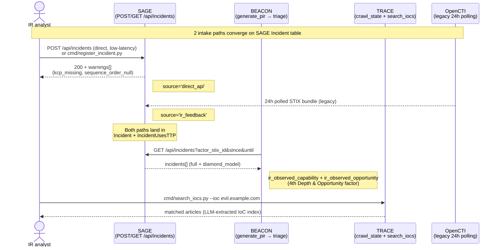

# IR Feedback Flow — closing the CTI loop

**Authoritative source**: `sage/docs/ir-feedback-flow.md`. BEACON and
TRACE copies live at `beacon/docs/ir-feedback-flow.md` and
`trace/docs/ir-feedback-flow.md` as relative symlinks to this file.
Update once here and both consumers see the change.

This document describes the end-to-end IR-observe → SAGE-register →
BEACON-rescore → TRACE-search loop introduced in Initiative G
(BEACON 0.18.0 + TRACE 1.11.0 + SAGE 0.13.0). It supplements (does
not replace) the existing OpenCTI-relayed incident ingestion path.

---

## 1. Loop diagram



---

## 2. Why a direct-API path

The OpenCTI relay (1×/day polling) has a 24-hour worst-case latency:
an incident observed today only influences BEACON's Likelihood
scoring tomorrow at the earliest. For operators without OpenCTI it
provides no path at all.

NIST SP 800-61r3 (April 2025) §2.1 captures the policy motivation
behind the direct-API addition (verbatim — NIST publication, US gov
public domain under 17 USC §105):

> The lessons learned during incident response should often be shared
> **as soon as they are identified**, not delayed until after
> recovery concludes. Continuous improvement is increasingly
> necessary for all facets of cybersecurity risk management in order
> to keep up with modern threats.

The direct API satisfies the "as soon as they are identified"
property. The OpenCTI path remains valid; the two converge on the
`Incident` table and are discriminated by `Incident.source`
(`direct_api` vs `ir_feedback`).

---

## 3. Two intake paths

### 3.1 OpenCTI-relayed (legacy, retained)

| Property | Value |
|---|---|
| Component | OpenCTI Web UI + nightly poller |
| Latency | up to 24 h |
| `Incident.source` | `ir_feedback` |
| Pre-req | OpenCTI deployment |
| Best fit | Orgs already running OpenCTI |

### 3.2 Direct-API (new — Initiative G)

| Property | Value |
|---|---|
| Component | `POST /api/incidents` (SAGE Phase 1) |
| Latency | seconds |
| `Incident.source` | `direct_api` |
| Pre-req | `SAGE_API_AUTH_TOKEN` env (write API gate) |
| Best fit | SMB orgs without OpenCTI; live incident response |

Both paths populate `Incident` + `IncidentUsesTTP` rows with the same
schema. Downstream queries (`/actor-ttps`, `/asset-exposure`,
`/threat-summary`, `GET /api/incidents`) read both transparently.

---

## 4. Direct-API write surface (SAGE)

### POST /api/incidents

PUT-like full-replace upsert (`incident_stix_id` is PK; re-POST
replaces the prior record entirely). Required fields: `incident_stix_id`
(STIX 2.1 incident pattern), `name`, `occurred_at`, `severity`.
Optional: `kill_chain_phases[]`, `ttps[]` (with `sequence_order`),
`diamond_model` (4-key dict per Caltagirone et al.), `iocs[]`,
`description`.

Missing optional fields surface as response `warnings[]`:

| Code | Meaning |
|---|---|
| `kcp_missing` | No `kill_chain_phases` — no `IncidentUsesTTP` rows derived |
| `sequence_order_null` | At least one `ttps[].sequence_order` is NULL — `FollowedBy(ir_feedback)` derivation skipped per HLD §5.2 |

Warnings also increment a `sage_incident_warnings_total{code}` counter
(structlog log fallback when no Prometheus endpoint).

### GET /api/incidents

Read endpoint consumed by BEACON's IR-boost (§5 below) and operator
CLI tooling. Filters: `since` / `until` (occurred_at range) /
`actor_stix_id`. Pagination is limit-only (default 50, range 1-100).
Response includes `incidents[].ttps[]` + `diamond_model` inline.

GET routes remain permissive when `SAGE_API_AUTH_TOKEN` is unset
(backward-compatible with current deployments); when set, normal
Bearer auth applies. POST routes are required-when-set and return
**503 when the token is unset** (write API foot-gun gate — see §7).

### cmd/register_incident.py (CLI helper)

Click-based CLI for IR analysts. Four modes:

| Mode | Flag | Use case |
|---|---|---|
| Interactive | (no flag) | Prompts 4 Diamond Model quadrants with hints |
| File | `--from-file payload.json` | Non-interactive scripts |
| Navigator | `--navigator-layer layer.json` | Import MITRE Navigator TTP sequence |
| Direct | `--no-api` | Air-gapped — write Spanner directly, bypass HTTP |

`--id incident--<uuid>` overrides auto-generated `incident--<uuid4>`.
`--token` defaults to `$SAGE_API_AUTH_TOKEN`.

---

## 5. BEACON IR-boost (Phase 6)

BEACON's `generate_pir` pipeline calls SAGE `GET /api/incidents`
during actor triage. Two new factors enter the
`Likelihood = Intent × Capability × Opportunity` formula:

| Factor | Where | Formula |
|---|---|---|
| `ir_observed_capability` | Capability 4th Depth factor | 1.0 if ≥1 own-org incident in lookback uses this actor's known TTPs; else 0.5 (neutral, not 0) |
| `ir_observed_opportunity` | Opportunity 4th factor | 1.0 if actor ever attacked own org in lookback; else 0.7 (residual neutral) |

Aggregation preserves the [0, 1] geometric-mean scale established in
Initiative E:

```
Depth       = (sophistication × tool_sophistication × evasion_capability × ir_observed_capability) ^ (1/4)
Opportunity = (victimology_match × geographic_match × surface_ttp_coverage × ir_observed_opportunity) ^ (1/4)
```

Methodology citation (MITRE Cyber Prep, fair-use academic quote,
© MITRE Corporation): Cyber Prep
defines Capability as "resources, skill or expertise, **knowledge**,
and opportunity" — IR observation of past attacks directly supplies
the *knowledge* signal. Cyber Prep's Targeting ("how broadly or
narrowly and how persistently the adversary targets a specific
organization") maps to BEACON's `ir_observed_opportunity`.

### Lookback window

`BEACON_IR_LOOKBACK_DAYS` env var (default 365). Single global
setting — no per-actor configurability in this initiative.

### Fail-soft

If SAGE is unreachable, both factors default to neutral 1.0 (identity
in the geometric mean), `data_quality.degraded=True` is set on the
prioritized_actor entry, and the failure reason is emitted as a
structured log. Operators can also skip the call explicitly with
BEACON's `--no-sage` flag (sets `data_quality.ir_boost_skipped=True`
for caller visibility).

---

## 6. TRACE IoC search (Phase 4 + 5)

### IoC index (Phase 4)

TRACE's existing google-genai (Vertex AI) call that runs the L2 PIR
relevance gate is extended to also return a structured `iocs[]` list.
Single LLM round-trip per article — no extra cost. Seven IoC types:
IPv4, IPv6, FQDN, SHA256, SHA1, MD5, CVE-ID. Each entry carries
`type`, `value`, `confidence`, and a 50-char `context_snippet`
around the IoC in the article text.

Regex-based extraction was rejected by user policy (2026-05-23) due
to unacceptable false-positive rate on real CTI articles. The LLM
prompt requests empty list in preference to speculative extractions.

### Search CLI (Phase 5)

`cmd/search_iocs.py --ioc <value> [--type <t>] [--tlp-max <level>]`
queries `crawl_state.json` for matching IoCs and returns the
articles that mention them.

Default `--tlp-max=amber` hides TLP:RED bundles to prevent accidental
sharing. `--tlp-max=red` is operator-explicit opt-in. The 9 canonical
TLP marking-definition UUIDs (TLP 1.0 + 2.0) are recognized;
most-restrictive marking wins per bundle. Bundles without an explicit
marking default to TLP:CLEAR.

`--json` output is jq-friendly — structlog warnings route to stderr
so the stdout stream stays machine-parseable.

Use case: IR analyst finds `evil.example.com` in a phishing payload,
runs `search_iocs.py --ioc evil.example.com`, learns the same domain
was mentioned in a CTI article 3 weeks earlier (existed in the index,
not yet acted on).

---

## 7. Auth gate (Decision 10)

Write APIs (`POST /api/incidents` from G + `POST /api/annotate` from
Initiative E) require Bearer auth via `SAGE_API_AUTH_TOKEN`. When the
env var is unset:

- **POST** routes return **503** (write API foot-gun gate — explicit
  refusal beats silent permissiveness)
- **GET** routes remain permissive (backward-compat with deployments
  that never set the token)

When the env var is set, all routes require Bearer headers (401 on
missing, 403 on wrong token).

The harmonization applied retroactively to `/api/annotate` in
Initiative G Phase 1 commit — prior E behavior of "optional with
warning" replaced by the gate.

---

## 8. Trade-offs: OpenCTI vs direct-API

| Dimension | OpenCTI | Direct-API |
|---|---|---|
| Latency | 24 h | seconds |
| Setup cost | OpenCTI deployment + maintenance | API token only |
| Schema | OpenCTI's STIX wrapper | SAGE's Pydantic request model (minimal) |
| Sequence order | Manual in OpenCTI Web UI | Optional — warning on NULL |
| 3rd-party reports | OpenCTI native | Same endpoint; note origin in `description` (Q5=NO separate source value) |
| Network requirement | OpenCTI server reachable | SAGE server reachable |
| Audit trail | OpenCTI log | SAGE structlog + Spanner audit |

Operators may use both paths simultaneously; `Incident.source`
discriminates downstream analyses.

---

## 9. Operator quick start

### IR analyst registering a new incident

```sh
# Interactive (recommended for first-time):
uv run python -m cmd.register_incident

# From MITRE Navigator export:
uv run python -m cmd.register_incident \
    --name "Q1 2026 spear-phishing wave" \
    --occurred-at 2026-03-15T10:30:00Z \
    --severity high \
    --navigator-layer ./navigator_2026q1.json

# Air-gapped (write Spanner directly, no HTTP):
uv run python -m cmd.register_incident \
    --from-file payload.json --no-api
```

### CTI analyst searching for an IoC

```sh
# Domain seen in a phishing payload — has it appeared in CTI before?
uv run python -m cmd.search_iocs --ioc evil.example.com

# Narrow to a specific type:
uv run python -m cmd.search_iocs --ioc T1078 --type cve_id

# Machine-readable for downstream pipelines:
uv run python -m cmd.search_iocs --ioc evil.example.com --json | jq '.[].matched_url'

# Include TLP:RED (explicit opt-in):
uv run python -m cmd.search_iocs --ioc evil.example.com --tlp-max red
```

### BEACON operator: enabling IR-boost

```sh
# Standard (BEACON calls SAGE for own-org incident history):
SAGE_API_URL=http://sage:8000 \
SAGE_API_AUTH_TOKEN=<token> \
BEACON_IR_LOOKBACK_DAYS=365 \
    uv run python -m cmd.generate_pir

# Skip SAGE call entirely (air-gapped / SAGE not deployed):
uv run python -m cmd.generate_pir --no-sage
```

---

## 10. References and license

This document cites the following external sources. Per the cross-
project citation policy (BEACON `docs/citations.md`), verbatim quotes
from US-government works (NIST SPs) and "distribution unlimited"
publications (Diamond Model paper) are reproduced freely with
attribution. Verbatim quotes from CC-BY-NC-ND or proprietary works
are not reproduced; concept paraphrase + cite is used instead.

| Source | License | Used here |
|---|---|---|
| NIST SP 800-61r3 (April 2025), §2.1 | US gov public domain (17 USC §105) | §2 verbatim quote |
| MITRE Cyber Prep — Bodeau, Fabius-Greene, Graubart, "How Do You Assess Your Organization's Cyber Threat Level?" | © MITRE Corporation, academic fair use | §5 short concept quote with attribution |
| Diamond Model — Caltagirone, Pendergast, Betz, "The Diamond Model of Intrusion Analysis" | Approved for public release; distribution unlimited | §4 4-quadrant terminology |
| STIX 2.1 §4.6 (Incident SDO) | OASIS open standard | Implicit (Incident table semantics) |

Full citation inventory: `beacon/docs/citations.md`.

---

*Initiative G — IR Feedback Ingestion. Last updated 2026-05-24
(triple release BEACON 0.18.0 + TRACE 1.11.0 + SAGE 0.13.0).*
